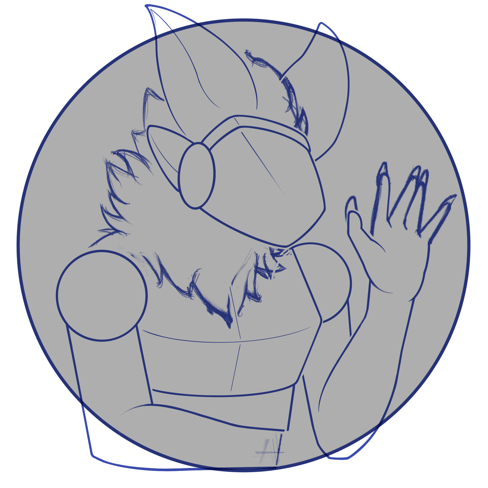
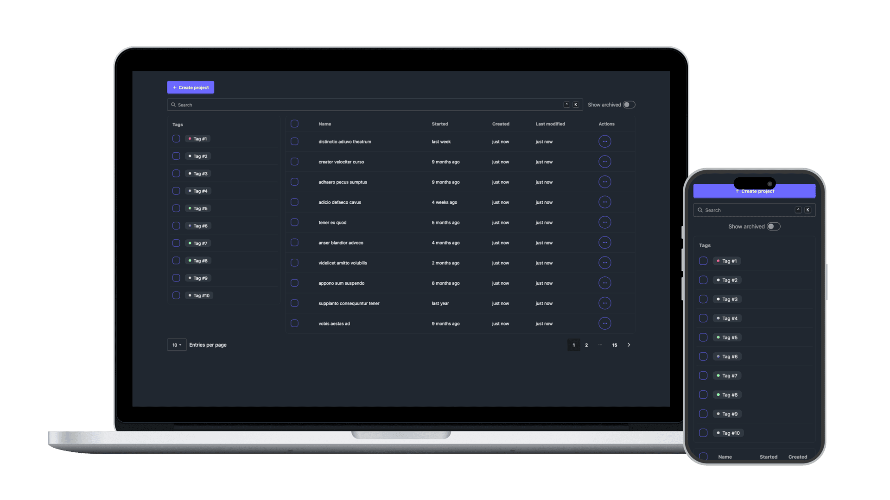

<a id="readme-top"></a>

<!-- TITLE -->
<div align="center">
    <figure>
        
        <figcaption style="font-size: x-small; opacity: 50%;">Mascot logo in progress.</figcaption>
    </figure>
    <h1>Geckobot</h1>
</div>

<!-- SUBTITLE -->
<div align="center" style="margin-bottom: 12px;">
    <h4>An app that helps to organize your artwork projects and files.</h4>
</div>

<!-- BADGES -->
<div align="center" style="margin-bottom: 12px;">
    
    
    
</div>

<!-- CONTENTS -->
<div align="center" style="margin-bottom: 12px;">
  <a href="#about">About</a> •
  <a href="#getting-started">Getting Started</a> •
  <a href="#contributing">Contributing</a> •
  <a href="#license">License</a>
</div>

<!-- DEMO -->

<div align="center">
   <figure>
      
      <figcaption style="font-size: x-small; opacity: 50%;">Pre-release demo.</figcaption>
   </figure>
</div>

<!-- ABOUT -->

## About

**Geckobot** is an app designed to help you organize your artwork files efficiently. With a modern tech stack and a modular architecture, Geckobot streamlines the process of managing, searching, and categorizing your creative assets.

### Features

- Organize and categorize artwork projects and its files.
- Modern, responsive UI.
- Extensible and modular codebase.

### Built With

- 
- 
- 
- 
- 
- 

### Project Structure

The repository uses a monorepo structure with all core components under the `packages/` directory:

```
Geckobot/
├── LICENSE
├── README.md
├── package.json
├── package-lock.json
└── packages/
    ├── datasource/
    ├── datasource-express/
    ├── datasource-mock/
    ├── express/
    └── vue/
```

- `datasource/`: Core data access and abstraction layer, shared by backend and frontend.
- `datasource-express/`: Handles API endpoints and bridges data between backend and frontend.
- `datasource-mock/`: Provides fake/mock data for development and testing.
- `express/`: The main backend server built with Express.js.
- `vue/`: The main frontend app built with Vue.js and TailwindCSS.

This modular structure makes it easy to maintain, test, and extend each part of the application independently.

<p align="right">(<a href="#readme-top">Back to top</a>)</p>

<!-- GETTING STARTED -->

## Getting Started

Follow these steps to set up this project locally:

### Prerequisites

Before you begin, make sure you have the following installed on your system:

- [Node.js](https://nodejs.org/) (version 22 or higher recommended)
- [npm](https://www.npmjs.com/) (comes bundled with Node.js)

You can check your installed versions with:

```sh
node --version
npm --version
```

If you need to install Node.js (and npm), follow the instructions for your operating system:

-  **Arch-based systems**

  ```sh
  sudo pacman -S nodejs npm
  ```

-  **Debian-based systems**

  ```sh
  sudo apt update
  sudo apt install nodejs npm
  ```

-  **CentOS / Fedora / RHEL-based systems**

  ```sh
  sudo dnf install nodejs
  ```

-  **macOS**

  ```zsh
  brew install node
  ```

-  **Windows**

  Follow the steps from [nodejs.org](https://nodejs.org/en/download).

Once Node.js and npm are installed, you’re ready to proceed with the installation steps below.

### Installation

1. **Clone** the repository.

   ```sh
   git clone https://github.com/heckodagecko/geckobot.git
   cd geckobot
   ```

2. **Install dependencies.**

   ```sh
   npm install
   ```

3. **Set up the environment variables.** Copy the example environment file and update as needed:

   ```sh
   cp packages/express/.env.example packages/express/.env
   cp packages/vue/.env.example packages/vue/.env

   # Edit both .env files with your preferred editor
   ```

4. **Build the datasource packages.**

   ```sh
   npm run build-datasource
   npm run build-datasource-mock
   npm run build-datasource-express

   # or...

   npm run build-all
   ```

5. **Run the app.**

   ```sh
   npm run start-express  # Start the backend
   npm run dev-vue        # Start the frontend

   # or...

   npm run dev  # Starts everything
   ```

<p align="right">(<a href="#readme-top">Back to top</a>)</p>

<!-- CONTRIBUTING -->

## Contributing

We welcome contributions of all kinds! To get started:

1. **Fork** the repository.

2. **Create a feature branch.**

   ```sh
   git checkout -b feature/your-feature
   ```

3. **Commit your changes** using [conventional commits](https://conventionalcommits.org/).

   ```sh
   git commit -m "feat: add your feature"
   ```

4. **Push to your branch.**

   ```sh
   git push origin feature/your-feature
   ```

5. **Open a pull request** and describe your changes.

Please ensure your code follows the existing style and includes relevant tests or documentation updates. For larger changes, consider opening an issue first to discuss your idea.

<p align="right">(<a href="#readme-top">Back to top</a>)</p>

<!-- LICENSE -->

## License

This project is licensed under the [GNU General Public License v3.0 (GPLv3)](LICENSE).  
You are free to use, modify, and distribute this software under the terms of the GPLv3.

<p align="right">(<a href="#readme-top">Back to top</a>)</p>
